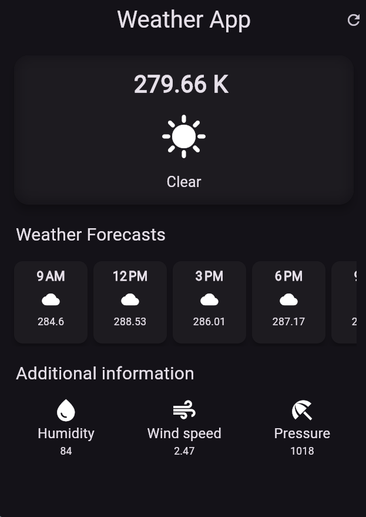

# weatherapp

A new Flutter project.

## Getting Started

This project is a starting point for a Flutter application.

A few resources to get you started if this is your first Flutter project:

- [Lab: Write your first Flutter app](https://docs.flutter.dev/get-started/codelab)
- [Cookbook: Useful Flutter samples](https://docs.flutter.dev/cookbook)

For help getting started with Flutter development, view the
[online documentation](https://docs.flutter.dev/), which offers tutorials,
samples, guidance on mobile development, and a full API reference.
### Discription
Stay ahead of the forecast with Weather App, your sleek and accurate weather companion. Whether you're planning your day or packing for a trip, this app gives you real-time updates and detailed forecasts at your fingertips.
### key features 
- Minimalistic UI
- Real time weather
- 7 day forecast
- open weather API
- humidity 
- windspeed

### screen

